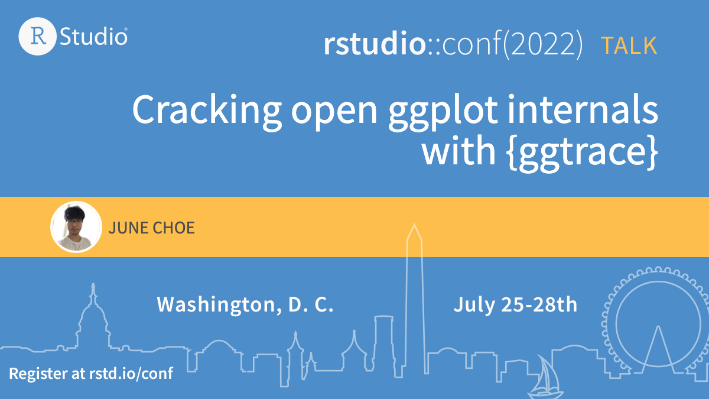

# {ggtrace} @ rstudio::conf 2022 

Slides for [rstudio::conf 2022](https://rstudioconf2022.sched.com/) talk "Cracking open ggplot internals with ggtrace"

Links:

- Talk recording: TBD

- Slides: [https://yjunechoe.github.io/ggtrace-rstudioconf2022/](https://yjunechoe.github.io/ggtrace-rstudioconf2022/)

- Package website: [https://yjunechoe.github.io/ggtrace/](https://yjunechoe.github.io/ggtrace/)

- Package repo: [https://github.com/yjunechoe/ggtrace/](https://github.com/yjunechoe/ggtrace/)

 

